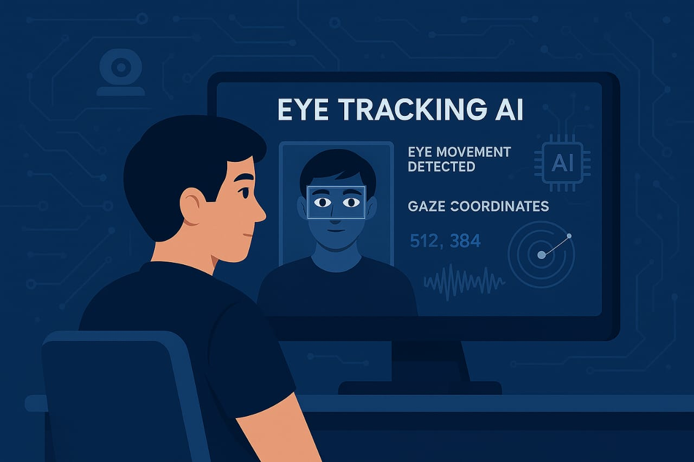

# Eye Controlled Mouse 🎯👁️

This project allows you to control your mouse cursor using your eye movements and perform clicks using blinks! Built using Python, OpenCV, MediaPipe, and PyAutoGUI.

## 🔧 Features

- Real-time eye tracking with MediaPipe Face Mesh
- Cursor movement based on iris position
- Blink detection for mouse click
- Smooth cursor movement

📸 Algorithm




---

## 🎬 Demo Video


## 📦 Requirements

Install dependencies with:

```bash

pip install -r requirements.txt

```
