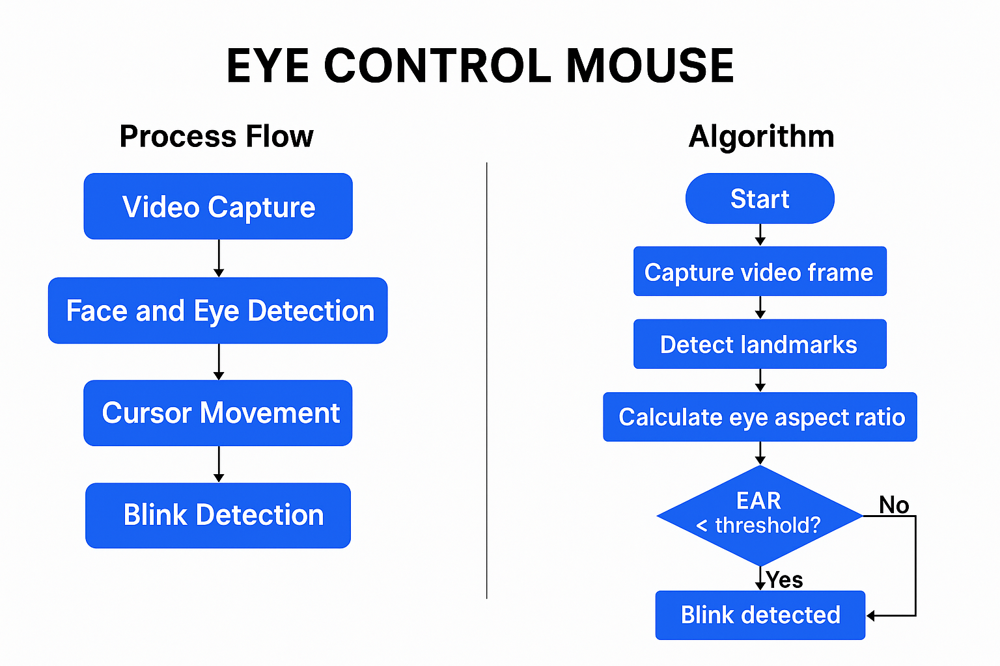

# Eye Controlled Mouse 🎯👁️
# 📷 How it Works: 
* Uses MediaPipe to extract facial landmarks  Tracks the right eye's pupil and calculates its position on screen.
* Detects blinks using Eye Aspect Ratio (EAR) Clicks the mouse when a blink is detected.
<p float="left">
  
</p>

This project allows you to control your mouse cursor using your eye movements and perform clicks using blinks! Built using Python, OpenCV, MediaPipe, and PyAutoGUI.

## 🔧 Features

- Real-time eye tracking with MediaPipe Face Mesh
- Cursor movement based on iris position
- Blink detection for mouse click
- Smooth cursor movement

## 🧪 Usage
Make sure your webcam is connected.

Look at the screen and move your eyes to control the cursor.

Blink once for a left-click.

Blink twice for right-click.

Blink three times for scrolling.

📸 Algorithm

<p float="left">  
  
</p>


---

## 🎬 Demo Video

[▶️Sample 1 video](assets/video.mp4)
[▶️Sample 2 video](assets/video1.mp4)

## NOTE: In Above Attachments Click on view Raw to watch the Samples

## 📦 Requirements

Install dependencies with:

```bash

pip install -r requirements.txt

```
